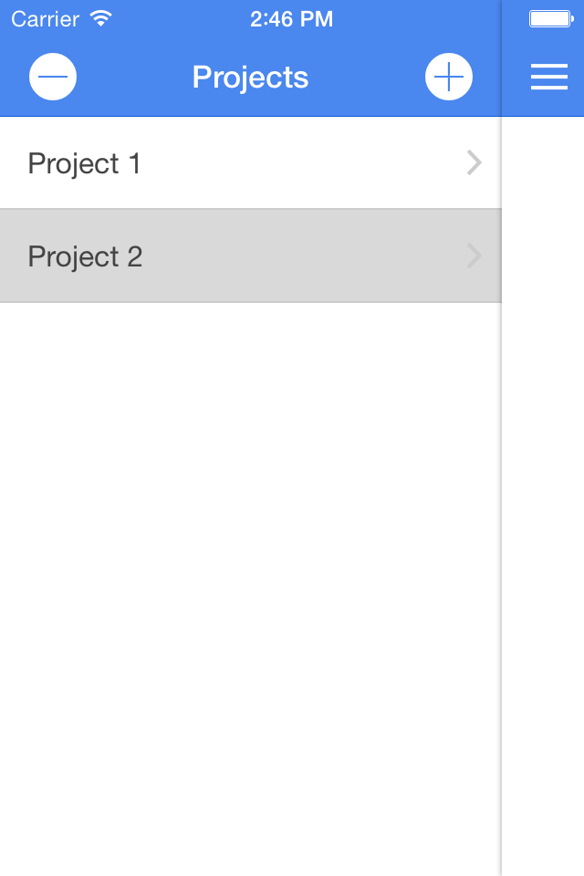

## Synopsis

An Ionic-AngularJS Todo Mobile App. 
Programmed using the Ionic Framework [Ionic Framework](http://ionicframework.com/).
Based on the example given on the Ionic Website.
The Ionic Framework allows native type mobile apps to be created using AngularJS, HTML5, 
CSS and Cordova/Phonegap

## Code Example

Allows projects to be created and deleted. Each project can contain a list of tasks.
Tasks can be created and deleted for each project.

Uses the following concepts:

* side-menu : navigation

* template file : stores data in template-cache, allows code to be removed from Index.html

* HTML5 localstorage 

* checkbox input type : I did not use ion-checkbox as it did not work well for me along with ion-list

* ng-change : to track changes to state of checkbox

* option-buttons : used to show delete buttons for both projects and tasks

* AngularJS form Validation (bypassing HTML5 validation) 

## iOS Simulator Screen Shots

	</img>
	
	</img>

	</img>
	
	</img>
	
	</img>

## Motivation

Learning AngularJS and how it can be used to create native type mobile phone Apps using 
Ionic, HTML5, CSS3 and Cordova (previously called Phone Gap)

Michael Cullen 2014